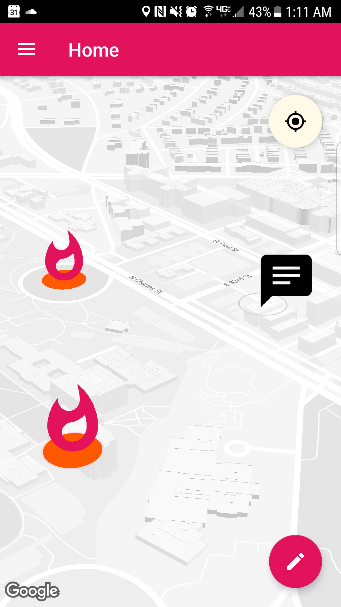

# Hotspots
An Android app for discovering local communities.

This app consists of three activities:
- LoginActivity
- Main Activity, with the following fragments:
  - MapHome
  - Statistics
  - Settings
  - Feed
- NewPostActivity

An overview of all features in each activity/fragment:
- LoginActivity:
  All new users are taken to this page in order to register/log in with an existing account
  All passwords must be at least 6 characters long
- Main Activity:
  After successful registration/authentication, users are taken to the main activity, which consists of a frame layout that can be replaced by a fragment. We've used fragments in order to successfully implement a navigation drawer for our app.
  - MapHome: A Google maps view of the user's current location and any hotspot pins that are around them
  - Statistics: A view of the user's post statistics, which includes total number of likes on their posts, total number of posts they have created, and total number of hotspots they have been a part of
  - Settings: A fragment where users can change their username and user icon
  - Feed: A view of all the posts in a Hotspot/current location - accessible by clicking on a pin on MapHome. Users who have chosen to be anonymous show up on the feed with the username 'Anonymous' and a default icon. Each user can 'like' a post once by clicking on the thumb icon; clicking on the icon again will undo the 'like'. Long-clicking on picture posts will give a context menu that allows the user to save the picture to gallery.
- NewPostActivity: An activity where the user can either post a text or picture post (accessible through a tab menu). The user also has an option to be anonymous or use their username and user icon by toggling an on/off 'Be anonymous' button. 

Firebase Details
We used Firebase to store our authenticated users, photos and user icons, posts and hotspots. Users and photos/user icons data are stored according to Firebase tutorials/default practices. Posts and Hotspots are encoded as objects in Java and then written out to Firebase.
Each Post contains:
- Username (the user's current username)
- Message (a text message/caption to a picture)
- Image URL (a URL String that links to where the picture is stored in Firebase)
- User Icon URL (a URL String that links to where the user icon is stored in Firebase)
- Number of likes (# of likes a post has gathered)
- Timestamp (when a post is submitted)
- Latitude/Longitude (where a post is submitted, note that each is stored as a double in Firebase)
- User ID (the poster's user ID)
- Hotspot Created (number of hotspots this post has been a part of)
- Liked By (a list of user ID strings that have 'liked'/clicked the thumb icon on this post)

Each Hotspot contains:
- Latitude/Longitude (where the centroid of the hotspot is)
- Posts (a list of Firebase keys for all the posts that are included in the hotspot) 

Hotspot Implementation notes:
The intention of the implementation of Hotspots is to generate them once there's enough traffic. Normally, in the implementation, we were thinking of a minimum of 10 posts per hotspot. For the sake of easier testing, we've lowered this number significantly.
